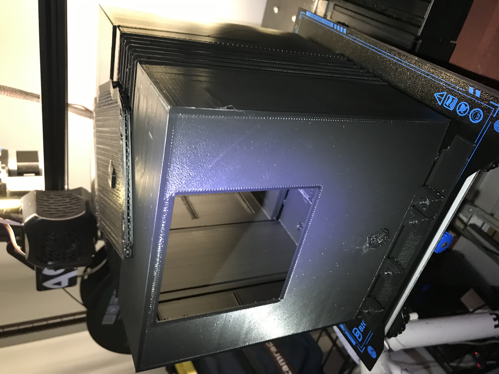
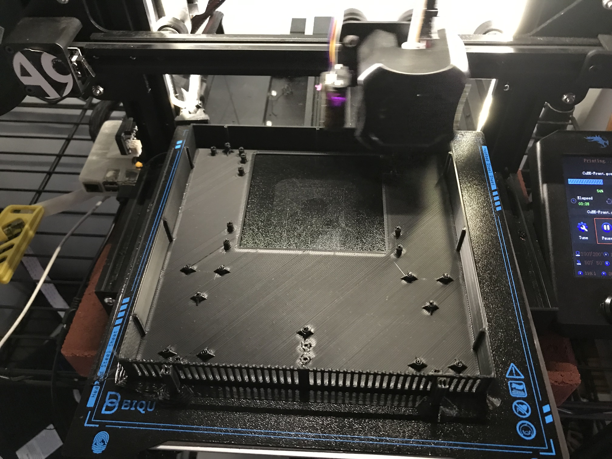
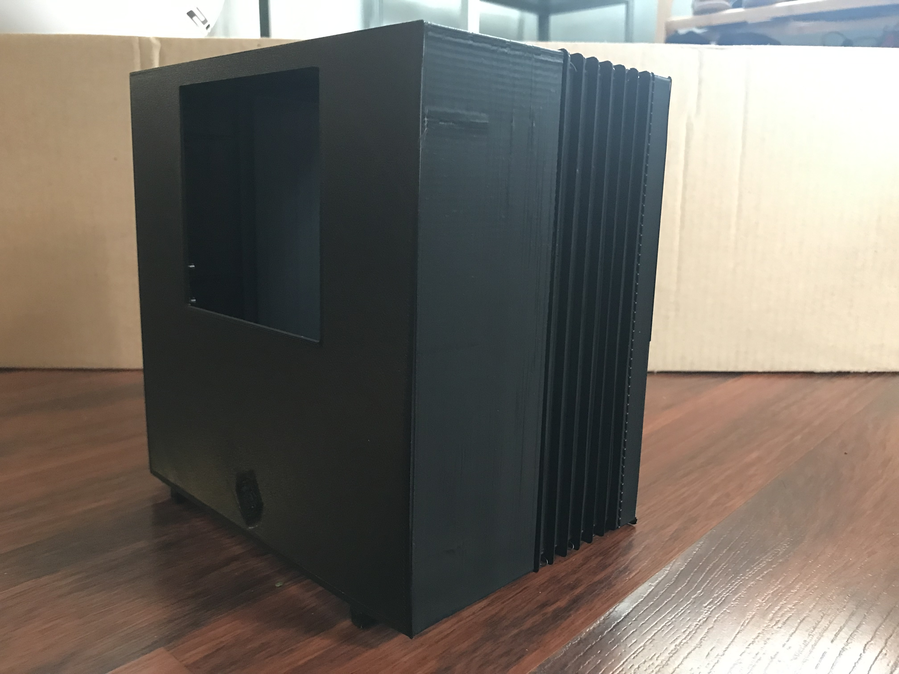
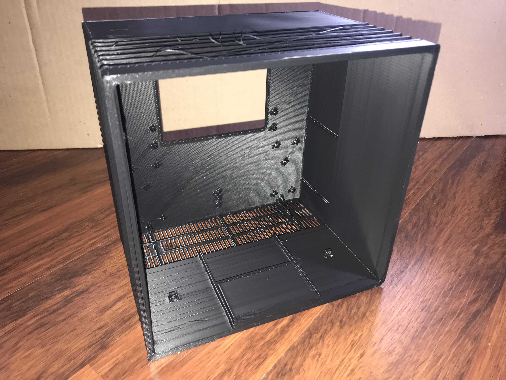
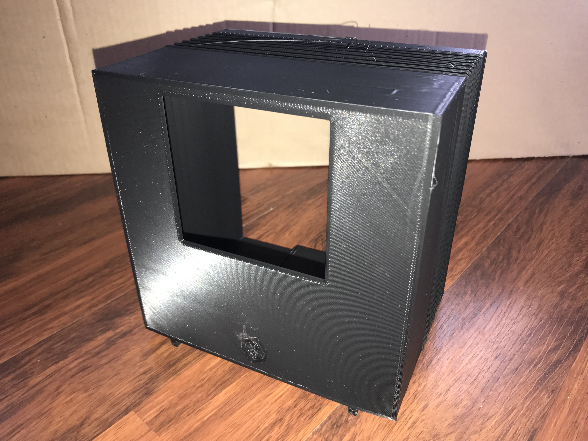
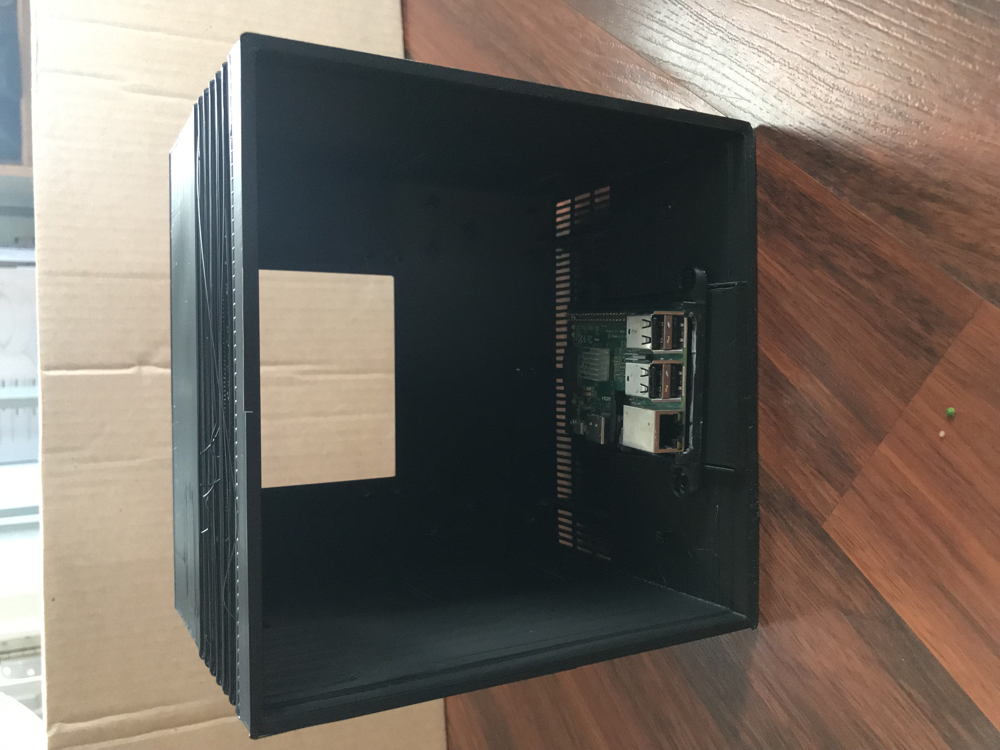

# NeXT Computer Cube/Personal Mainframe

These STL files are from Nitro

http://www.nextcomputers.org/forums/index.php?topic=4739.msg27613

----

# Printing

- Printing at 300% gives an ~180mm Cube.

- Adjust wall thickness to suit. A profile with tweaked settings may follow.

Pics:

----

----

----

----

----

----

